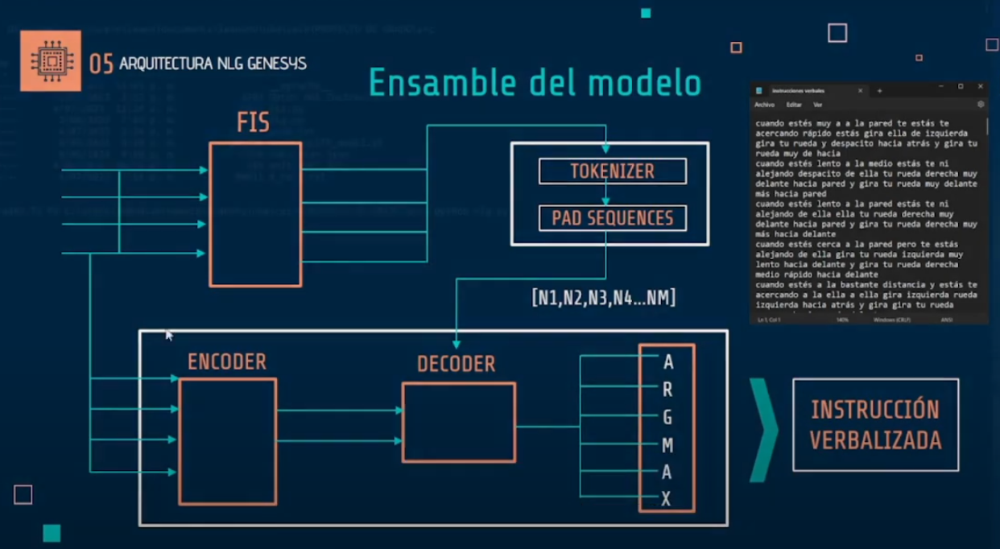
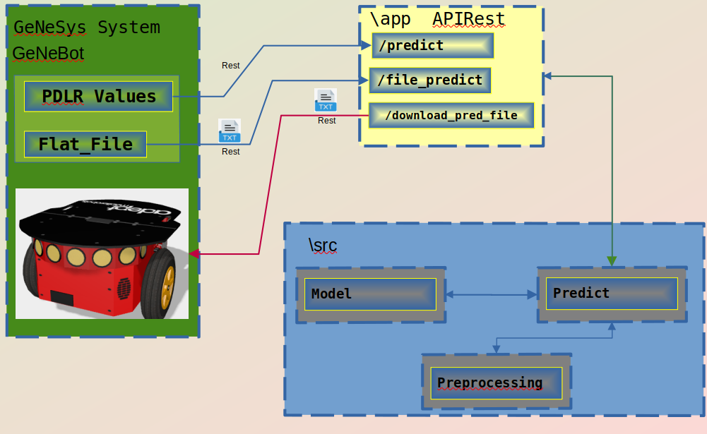

# Natural Language Generator for Wall Following Instructions

## Description

This project aims to develop a natural language generation (NLG) model capable of producing natural language instructions from numerical data. These instructions are intended to be used in teaching the "Wall Following" behavior in a simulated society of robots.

The project is part of the Neuro-memetics concept of the GeNeSyS project, led by MSc. Eng. Dante Sterpin. In this context, cultural behaviors are inherited through neural agents called Neuro-Nemes, and the Wall Following behavior is transmitted over several generations of robots using an ANFIS (Adaptive Neuro-Fuzzy Inference System) and a SOM (Self-Organizing Map) to numerically encode the behaviors into four sensomotor variables: P, D, L, and R.

## Model Architecture

The proposed model in this project uses an encoder-decoder architecture based on recurrent neural networks (RNN) and, more specifically, on Long Short-Term Memory (LSTM) cells. The encoder takes the numerical values of the sensomotor variables (P, D, L, R) as input and encodes this information into an internal state. The decoder, initialized with the encoder's internal state, sequentially generates the words that form the natural language instruction.

ARCHITECTURE OF THE SOLUTION

## Research

The project includes a /Research directory containing the experiments conducted during the project's development. The data directory contains files that can be used for testing.

## Model Usage

1. Install dependencies: `pip install -r requirements.txt`
2. Initialize the app with uvicorn: `uvicorn app.main:app --host 0.0.0.0 --port 8000 --reload`
3. Test the API at `localhost:8000/docs`

## Additional Resources

- [Project explanatory video](https://www.youtube.com/watch?v=MaL60VVGqQg)
